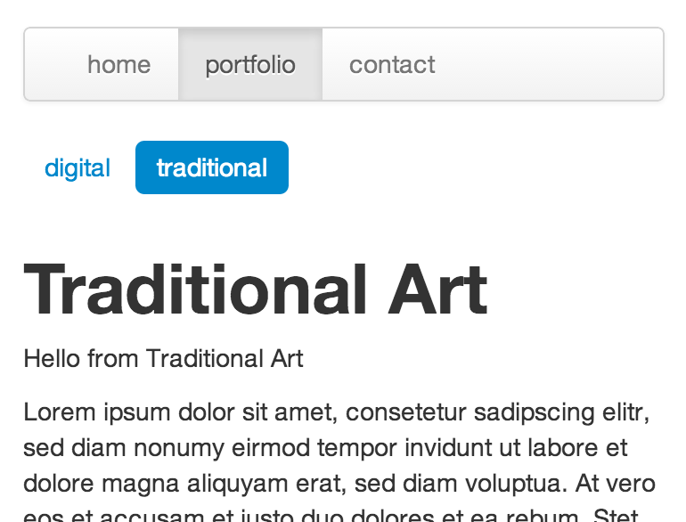

# Navigation for Jekyll

This gem provides [Jekyll](http://github.com/mojombo/jekyll) tags to render navigation lists.

* generates [Twitter Bootstrap](http://github.com/twitter/bootstrap) compatible html markup
* supports 2 separate navigation layers (root + sub)
* supports ordering 

]

## Example Usage

In `example-jekyll-site/` folder you'll find a complete jekyll project with navigation example.

Navigation is generated from the basic pages:

	contact.md
	digital_art.md
	imprint.md
	index.md
	portfolio.md
	traditional_art.md

Excerpt from `example-jekyll-site/layouts/default.html`:

      

        

          

            <ul class="nav">
              
            </ul>
          

        

      

      
        

          <ul class="nav nav-pills">
            
          </ul>
        

      

Rendered example output `example-jekyll-site/_site/digital_art.html`:

      

        

          

            <ul class="nav">
              <li><a href="./index.html">home</a></li>
              <li class='active'><a href="./portfolio.html">portfolio</a></li>
			  <li><a href="./contact.html">contact</a></li>
            </ul>
          

        

      

      

        <ul class="nav nav-pills">
          <li class='active'><a href="./digital_art.html">digital</a></li>
		  <li><a href="./traditional_art.html">traditional</a></li>
        </ul>
      

## Installation

### With Bundler

Add this line to your application's Gemfile:

    gem 'jekyll-navigation'

And then execute:

    $ bundle

You'll need this plugin to load the Gemfile gems in Jekyll:

    # _plugins/bundler.rb
    require 'bundler/setup'
    Bundler.require(:default)

### Plain gem

You can also use this gem by install it yourself as:

    $ gem install jekyll-navigation

Then add this plugin:

    # _plugins/navigation.rb
    require 'jekyll-navigation'

## Contributing

1. Fork it
2. Create your feature branch (`git checkout -b my-new-feature`)
3. Commit your changes (`git commit -am 'Add some feature'`)
4. Push to the branch (`git push origin my-new-feature`)
5. Create new Pull Request

## Licencse

See [LICENSE.txt](LICENSE.txt)
